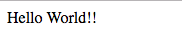

# iReactivity example
This is example of iReactivity usage. 
This is small app/example that change the name of app.
Details in: [./src/index.js](./src/index.js)


```jsx harmony
// src/index.js

import React from 'react';

// main functions of iReactivity
import {Provider, connect, update} from 'ireactivity';

// just an object
const store = { name: 'Hello' };

// just a view of App
const AppView = ({name, onClick}) =>
    <div onClick={onClick}>
        {name}
    </div>;

// connected AppView to the store
const App = connect(AppView, {
    name: (store) => store.name,
    onClick: (store) => store.name += ' World'
});

// rendering
ReactDOM.render(
    <Provider store={store}>
        <App/>
    </Provider>,
    document.getElementById('root')
);

// if you need to update store
// outside of components
// for ex. socket.io
let timeout30s = 30*1000; // just for example
update(store, (store) => {
    store.name = 'Something NEW!!!';
}, timeout30s);
```

## How to start
- `npm install`
- `npm start`

## iReactivity
[https://www.npmjs.com/package/ireactivity](https://www.npmjs.com/package/ireactivity) - Simple React binding 